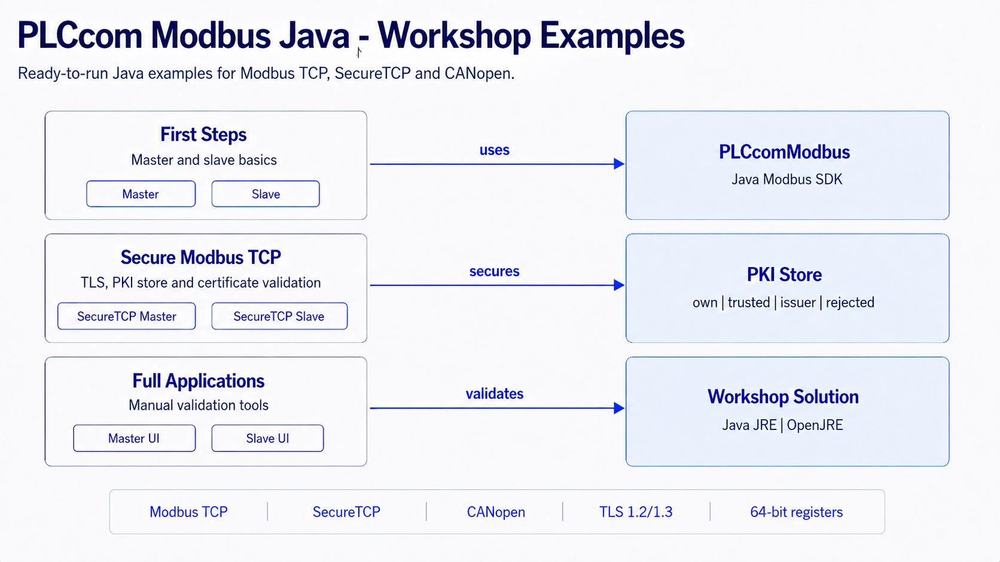



# PLCcom Modbus - Java Workshops

**Hands-on Modbus examples for Java developers and integrators**

Modbus is compact, but real projects quickly become concrete: which slave id is used, which function code is expected, which address base does the device manual use, which byte order belongs to a 32-bit or 64-bit value, and how can a developer prove what was actually sent on the wire?

This repository is built as a practical learning path around those questions. The examples are deliberately small at the beginning, then become more complete: first plain Modbus TCP, then Secure Modbus TCP with certificates and PKI handling, then CANopen-style access patterns, and finally the full Swing applications for manual validation.

The console workshops are meant to be read while they run. Start the slave, start the matching master, watch both consoles, change one detail, and run the pair again. The full applications are richer tools for the moment when a real device, simulator or customer setup needs to be inspected manually.

## 🧭 What You Will Find Here

| Area | What it teaches | Typical use |
|------|-----------------|-------------|
| **First Steps** | Plain Modbus TCP with one master and one slave. | Understand request and response flow before adding security or UI. |
| **Secure Modbus TCP** | TLS transport, local certificates, PKI folders, certificate validation hooks and authorization callbacks. | Learn how trusted, rejected, issuer and own certificates affect communication. |
| **CANopen** | CANopen-style object dictionary access through Modbus communication. | Work with devices that expose index/subindex based data through Modbus. |
| **Full Applications** | Swing master and slave applications. | Manual checks, troubleshooting, byte order validation, certificate review and field validation. |
| **PLCcom.Console** | Shared Swing console window used by the console workshops. | Keeps workshop output readable without duplicating console code in every project. |

## 🗂️ Repository Layout

~~~text
PLCcom.Console/
1 First Steps/
  11_Simple_Master_TCP/
  12_Simple_Slave_TCP/
2 Secure Modbus TCP/
  21_SecureTCP_Master/
  22_SecureTCP_Slave/
  23_MutualTLS_Loopback/
  24_RoleBasedAuthorization/
3 CANopen/
  31_CANopen_Master/
9 Full Applications/
  91_Full_Master_Sample/
  92_Full_Slave_Sample/
~~~

Each chapter contains its own README. Each numbered project also contains a README with run order, expected output and the important points to inspect in the source code.

## 🚦 Recommended Learning Path

| Step | Start here | Why |
|------|------------|-----|
| 1 | `12_Simple_Slave_TCP` | Run a predictable local slave before connecting to anything external. |
| 2 | `11_Simple_Master_TCP` | Read and write against that slave and inspect the request/response flow. |
| 3 | `21_SecureTCP_Master` and `22_SecureTCP_Slave` | Add TLS and see how the PKI store and certificate validation influence the connection. |
| 4 | `23_MutualTLS_Loopback` | Observe master and slave certificates in one compact process. |
| 5 | `24_RoleBasedAuthorization` | Learn where application-specific authorization decisions can be made. |
| 6 | `31_CANopen_Master` | Read and write CANopen-style object entries through Modbus. |
| 7 | `91_Full_Master_Sample` and `92_Full_Slave_Sample` | Move from teaching code to full manual validation tools. |

## 📦 Maven Package

The examples use the PLCcom Modbus Java package from Maven Central:

~~~xml
<dependency>
    <groupId>com.indi-an.plccom</groupId>
    <artifactId>plccom-for-modbus</artifactId>
    <version>9.x.x</version>
</dependency>
~~~

The concrete version used by this repository is configured once in the root `pom.xml` as `plccom.modbus.version`. If you want to test another PLCcom Modbus release, change that property in one place and rebuild the reactor.

## 🧰 Requirements

- Java 1.8 or newer runtime
- Maven 3.8 or newer
- A valid PLCcom Modbus license user name and serial number
- A Modbus device, simulator or one of the included slave workshops
- A desktop environment for the shared Swing console and the full applications

The SDK itself is Java 1.8 compatible. Newer JDKs can be used to build and run the examples as long as the selected PLCcom Modbus package supports them.

## 🚀 Getting Started

Clone the repository and build all modules:

~~~powershell
mvn clean package
~~~

For the first local test, start the slave first and then the master. In two separate terminals:

~~~powershell
mvn -pl "1 First Steps/12_Simple_Slave_TCP" -am exec:java -Dexec.mainClass=_12_Simple_Slave_TCP
mvn -pl "1 First Steps/11_Simple_Master_TCP" -am exec:java -Dexec.mainClass=_11_Simple_Master_TCP
~~~

You can also import the repository as existing Maven projects in Eclipse or another Java IDE and start the visible `main` classes directly.

## 🧪 Workshop Map

| # | Workshop | Short description |
|---|----------|-------------------|
| 11 | Simple Master TCP | Connects to a slave, writes registers, reads them back and prints diagnostic output. |
| 12 | Simple Slave TCP | Hosts a small Modbus TCP slave with predictable local test data. |
| 21 | SecureTCP Master | Shows the master-side SecureTCP setup with TLS options, PKI path and validation hook. |
| 22 | SecureTCP Slave | Hosts a SecureTCP listener and demonstrates local endpoint certificate handling. |
| 23 | Mutual TLS Loopback | Runs master and slave in one process so the complete TLS handshake is visible. |
| 24 | Role Based Authorization | Demonstrates a slave-side authorization callback for Modbus requests. |
| 31 | CANopen Master | Reads and writes CANopen-style object dictionary entries over Modbus. |
| 91 | Full Master Sample | Complete Swing master application for manual validation. |
| 92 | Full Slave Sample | Complete Swing slave application with TCP and SecureTCP listeners. |

## 🔐 Secure Modbus TCP and the PKI Store

SecureTCP uses TLS certificates. The examples create their PKI store locally when it is needed. The important folders are:

| Folder | Meaning |
|--------|---------|
| `own` | Local endpoint certificates. |
| `own/private` | Private keys for local endpoint certificates. |
| `trusted` | Remote certificates that are explicitly trusted. |
| `issuer` | Issuer or CA certificates used to validate certificate chains. |
| `rejected` | Unknown remote certificates that need review. |

The generated PKI folders are ignored by Git on purpose. They are local runtime material, not source code. A certificate or private key that is useful for one developer machine should not silently become part of a public example repository.

Some workshops use permissive certificate validators intentionally. That makes the control flow easy to understand, but it is not a production security policy. Productive applications should validate certificate identity, validity, chain, intended role and deployment-specific trust rules.

## 🖥️ Full Applications

The full master and slave applications are practical manual validation tools. Use them when a small console example is too narrow: inspect logs, try TCP and SecureTCP, compare byte order and register modes, review certificate handling and check a real device or simulator interactively.

## 📄 Licensing Information

**Examples License**

All example sources in this repository are released under the MIT License. You may use, modify and distribute the examples according to the license terms.

**PLCcom Library License**

The PLCcom Modbus library itself is proprietary software and is not part of the MIT license. To use the SDK in your own applications, you need a valid PLCcom Modbus license and must accept the applicable EULA.

## ⚠️ Safety Notice

The examples are written for learning, integration tests and manual validation. Do not use them unchanged in production, safety-critical or industrial environments. Review addresses, write operations, timeouts, TLS settings, certificate trust and authorization logic before connecting to real equipment.

## ™️ Trademark Information

All product names, company names and trademarks referenced in this repository are trademarks or registered trademarks of their respective owners. Their use is solely for identification and interoperability documentation.
